# 🚗 Ford Car Price — Exploratory Data Analysis

## 📋 Dataset Overview
- **Source**: Kaggle Ford Car Price Dataset
- **Original rows**: 17,966
- **Final rows after cleaning**: 17,760
- **Original features**: 9
- **Final features after engineering**: 26

---

## 🔧 Libraries Used
- pandas, numpy, matplotlib, seaborn, sklearn

---

## 🧹 Data Cleaning
| Issue | Action | Rows Affected |
|---|---|---|
| Duplicate rows | Removed | 154 |
| Year 2060 | Removed | 1 |
| Engine size 0.0 | Removed | 51 |
| Space in Focus model | Fixed | 1 |

---

## 📊 Phase 4 — Univariate Analysis

### Price Distribution
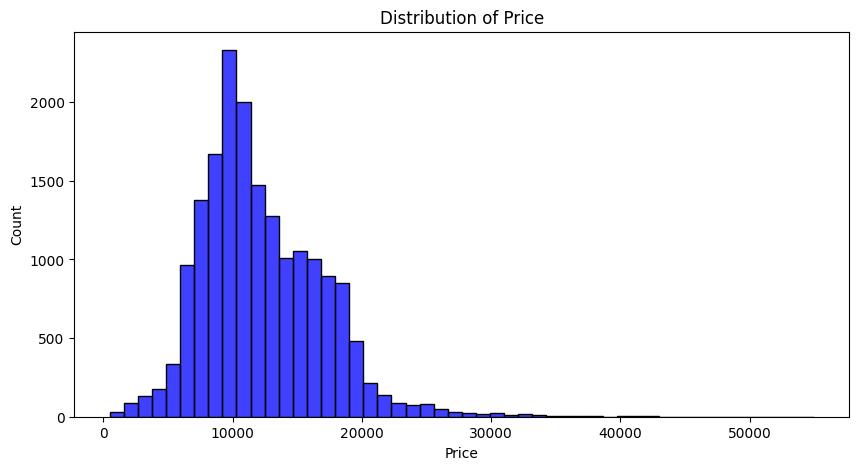
- Most cars priced between £8,000 - £12,000
- Distribution is right skewed
- Median price: £11,290

### Mileage Distribution
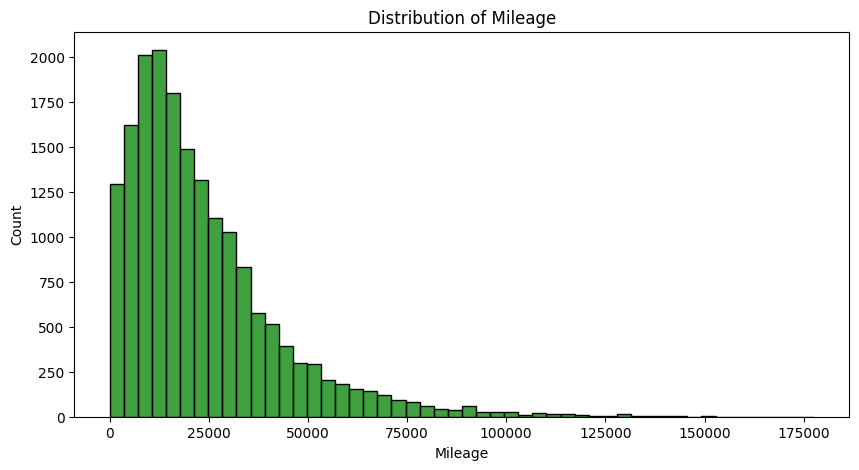
- Most cars have 10,000 - 15,000 miles
- Few cars with very high mileage (outliers)

### Year Distribution
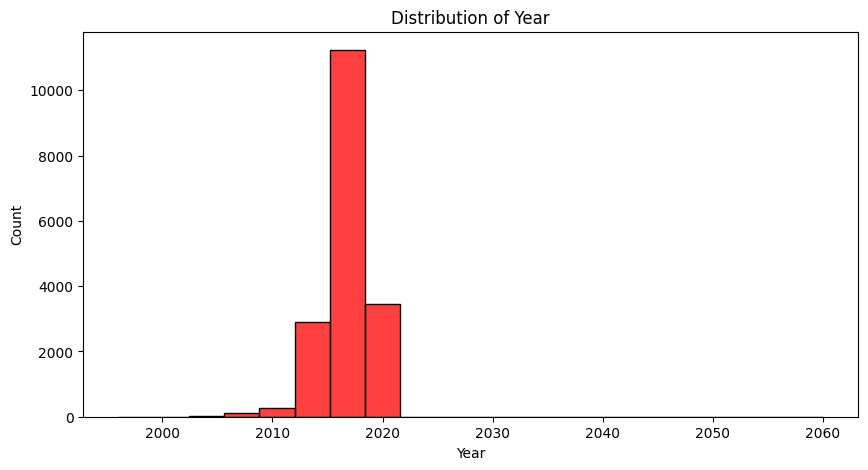
- Most cars from 2017
- Very few cars before 2010

### MPG Distribution
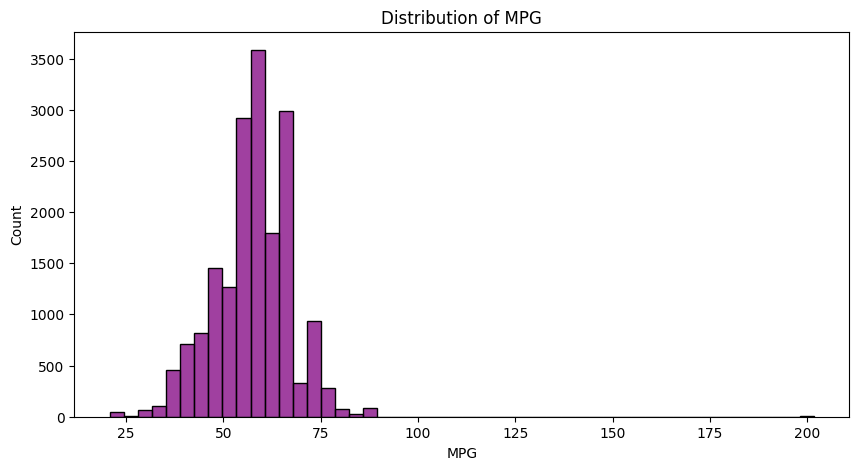
- Most cars have 55-60 MPG
- One suspicious outlier at 200 MPG

### Tax Distribution
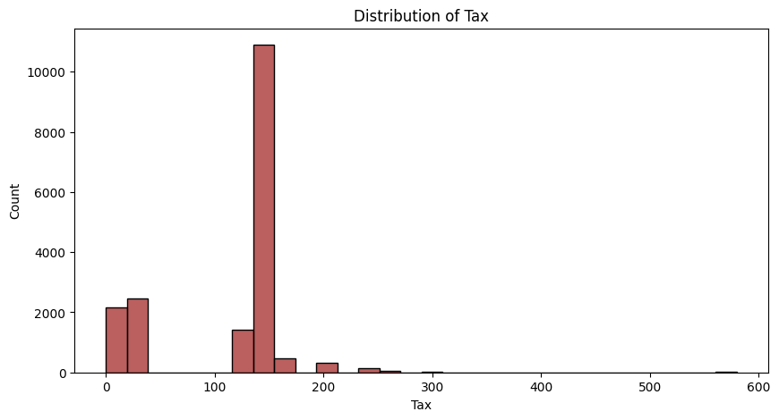
- Two groups: £0-30 (low emission) and £145-150 (standard)
- Most cars pay £145-150 tax

### Engine Size Distribution
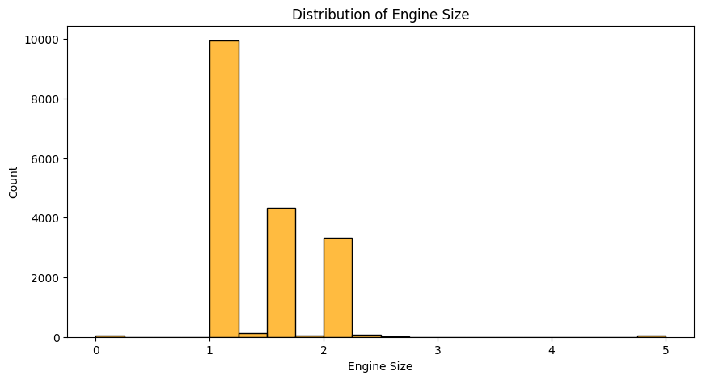
- Most cars have 1.0 litre engine
- Very few cars with large engines above 2.5

### Model Count
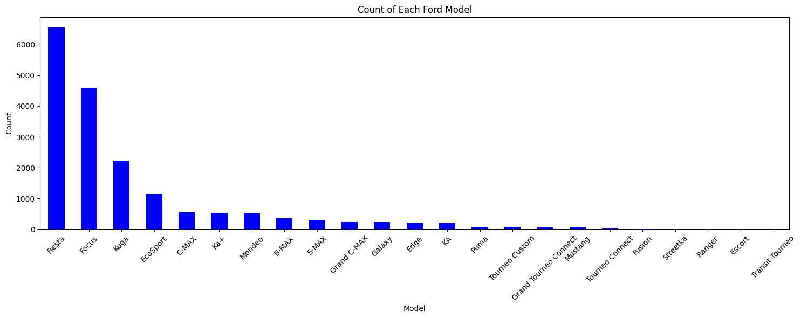
- Fiesta dominates with 6,489 cars
- Followed by Focus and Kuga

### Transmission Count
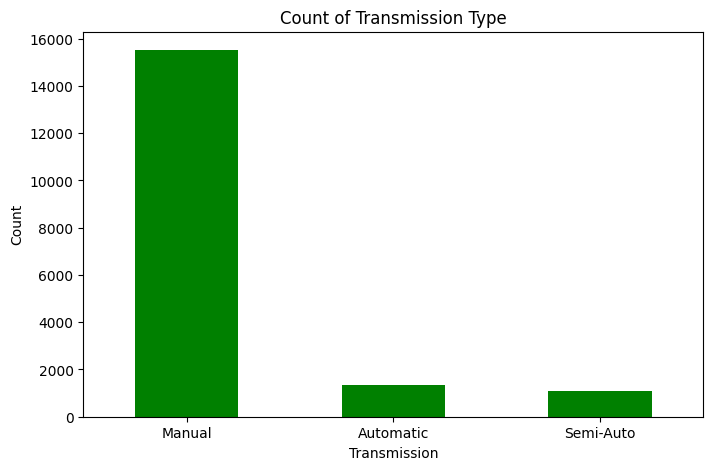
- 86% of cars are Manual
- Automatic and Semi-Auto are much fewer

### Fuel Type Count
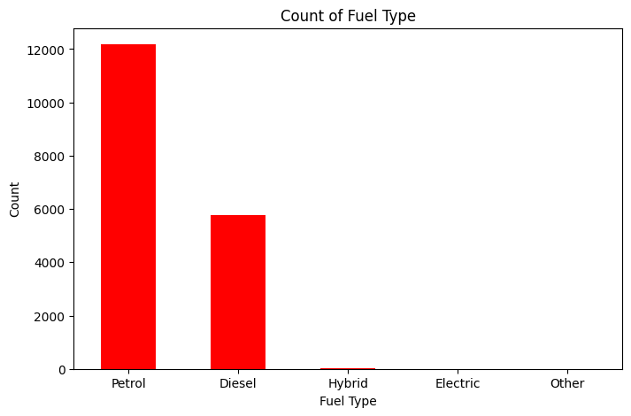
- 68% of cars are Petrol
- Diesel is second most common

---

## 📊 Phase 5 — Bivariate Analysis

### Year vs Price
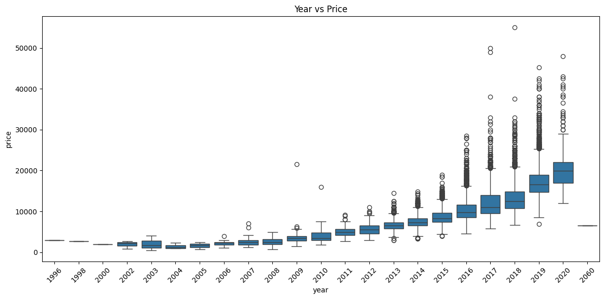
- Newer cars cost significantly more
- Strongest relationship with price (correlation: 0.64)

### Mileage vs Price
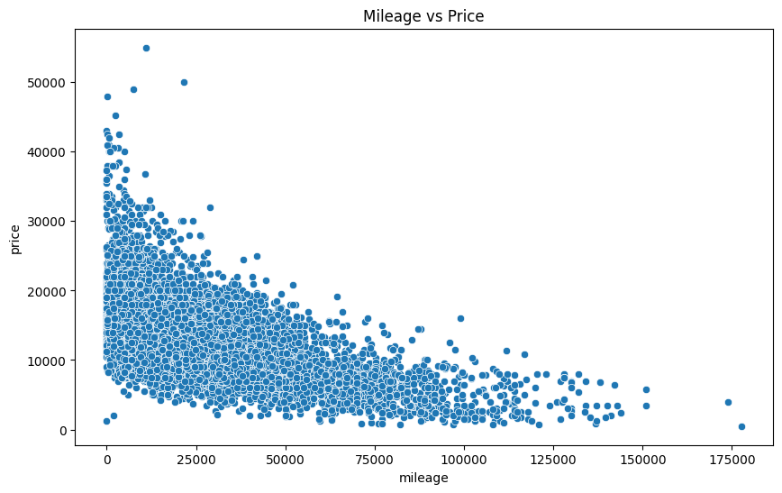
- Higher mileage = Lower price generally
- Strong negative correlation (-0.53)

### Engine Size vs Price
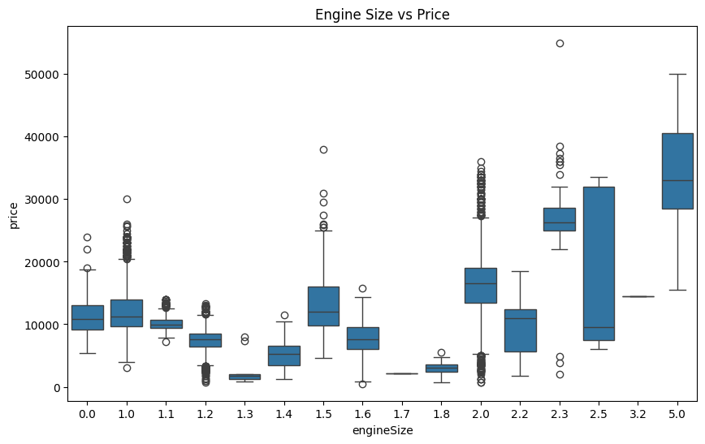
- Bigger engines generally more expensive
- Not perfectly linear

### Transmission vs Price
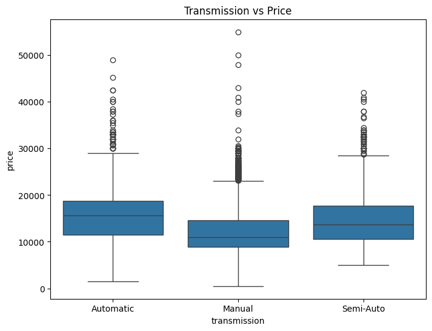
- Automatic (£15,720) > Semi-Auto (£14,897) > Manual (£11,783)

### Fuel Type vs Price
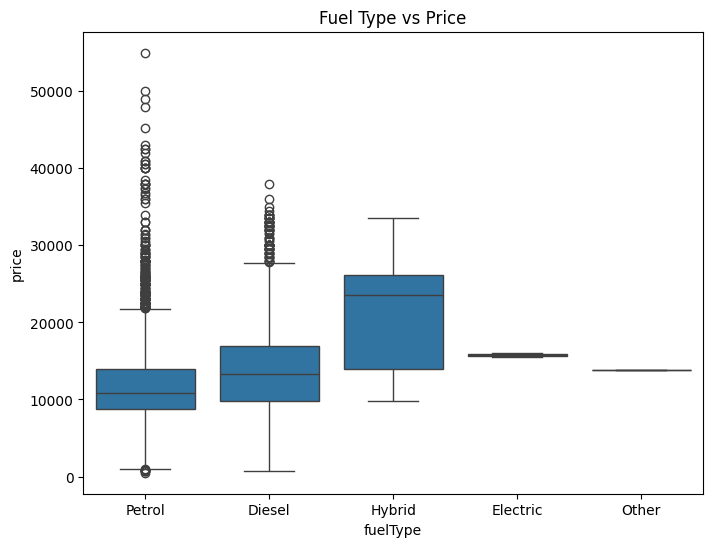
- Hybrid most expensive typically
- Petrol cheapest on average (£11,602)

### MPG vs Price
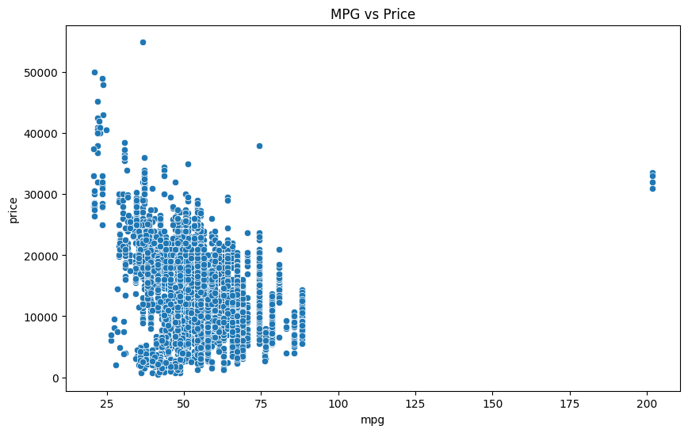
- No clear pattern between MPG and price

### Tax vs Price
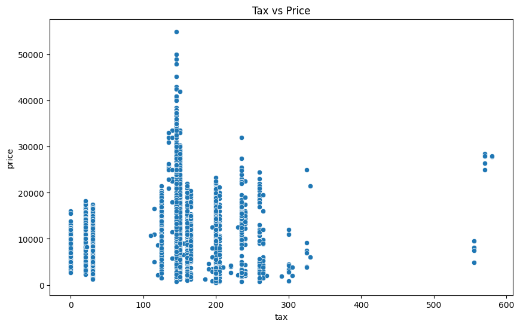
- No clear pattern between Tax and price

### Correlation Heatmap
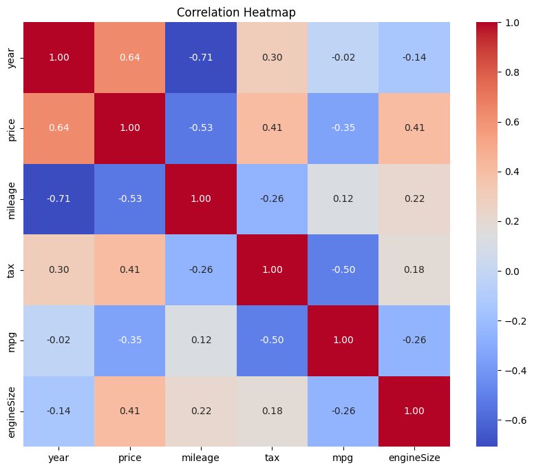
- Year strongest positive correlation (0.64)
- Mileage strongest negative correlation (-0.53)

### Average Price by Model
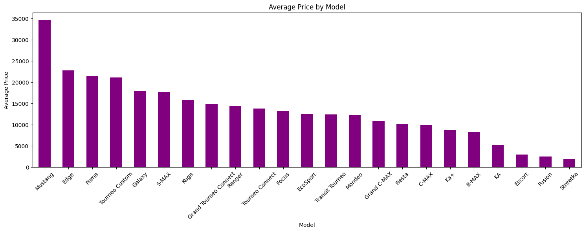
- Mustang most expensive (avg £34,967)
- Streetka cheapest (avg £1,924)

---

## 📊 Phase 5 — Multivariate Analysis

### Mileage vs Price by Transmission
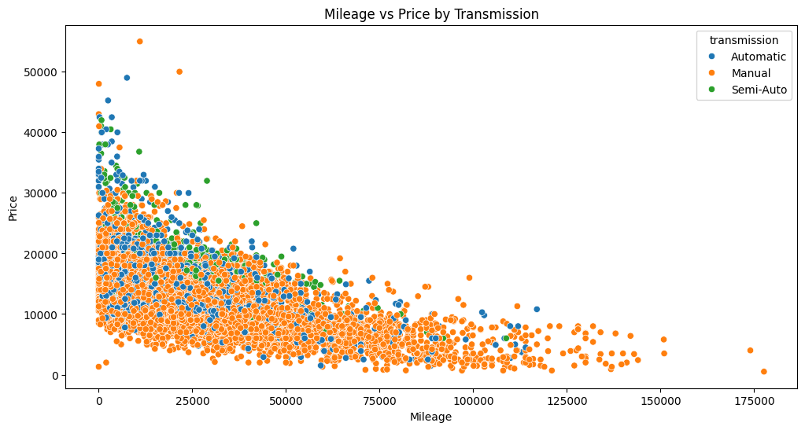
- Higher mileage = lower price for ALL transmission types
- Automatic cars sit higher in price at same mileage

### Year vs Price by Fuel Type
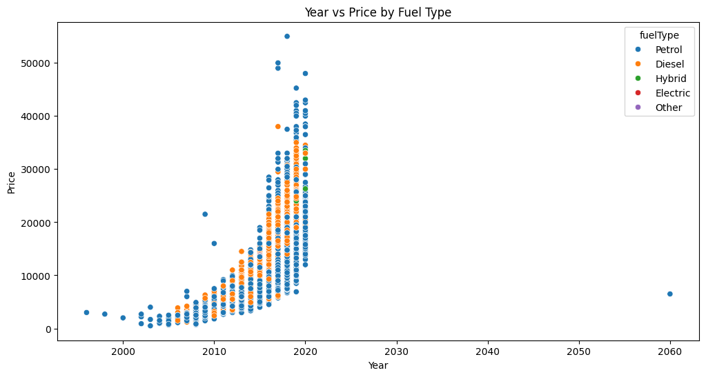
- Both Petrol and Diesel follow year trend
- Hybrid only appears in recent years

### Year vs Price by Transmission
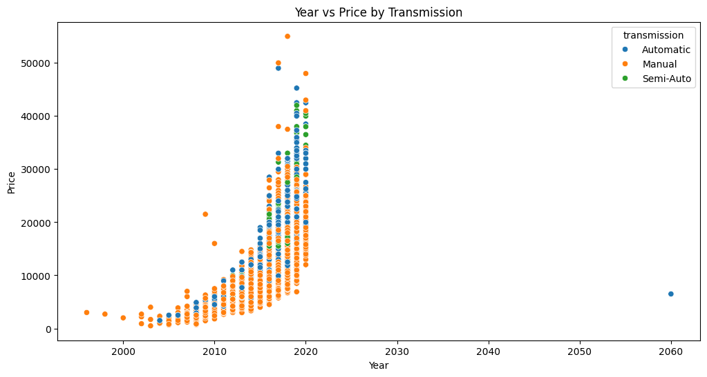
- Semi-Auto only appeared from 2017
- Manual exists across all years but generally cheaper

### Engine Size vs Price by Fuel Type
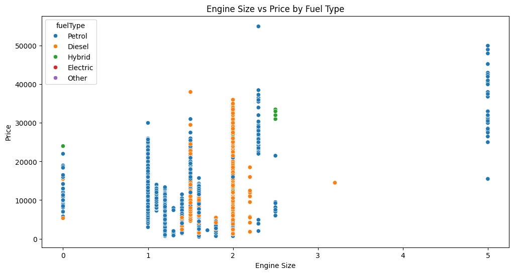
- Diesel only comes in mid range engines (1.5-2.0)
- Petrol comes in all engine sizes

### Year vs Price by Engine Size
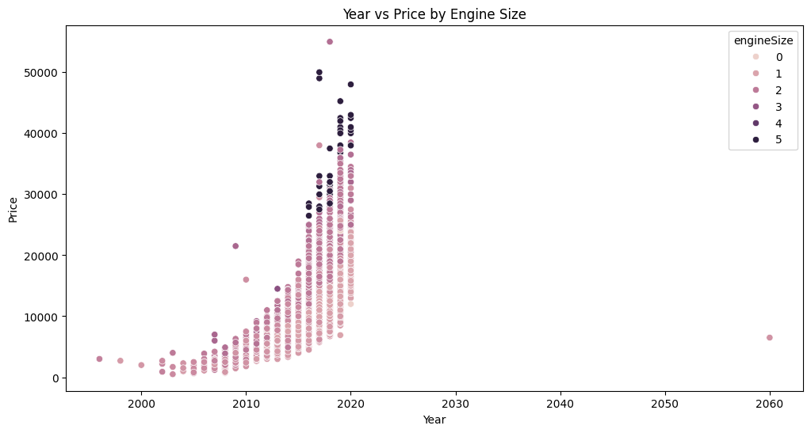
- Bigger engine + newer year = most expensive combination

---

## 🎯 Final Conclusions

### What Affects Ford Car Price:
| Feature | Impact | Direction |
|---|---|---|
| Year | ✅ Strongest | Newer = Higher |
| Mileage | ✅ Strong | Higher = Lower |
| Model | ✅ Strong | Mustang highest |
| Transmission | ✅ Moderate | Automatic highest |
| Engine Size | ✅ Moderate | Bigger = Higher |
| Fuel Type | ✅ Moderate | Hybrid highest |
| Tax | ❌ Weak | No clear pattern |
| MPG | ❌ Weak | No clear pattern |

### Features Dropped:
- Tax — no clear relationship with price
- MPG — very weak relationship with price

### Feature Engineering Done:
- Rare models (below 50 cars) grouped into Other
- Model encoded using One Hot Encoding
- Transmission encoded using Label Encoding
- Fuel Type encoded using One Hot Encoding

---
*EDA performed by a Plutonian who just landed on Earth! 🪐*
